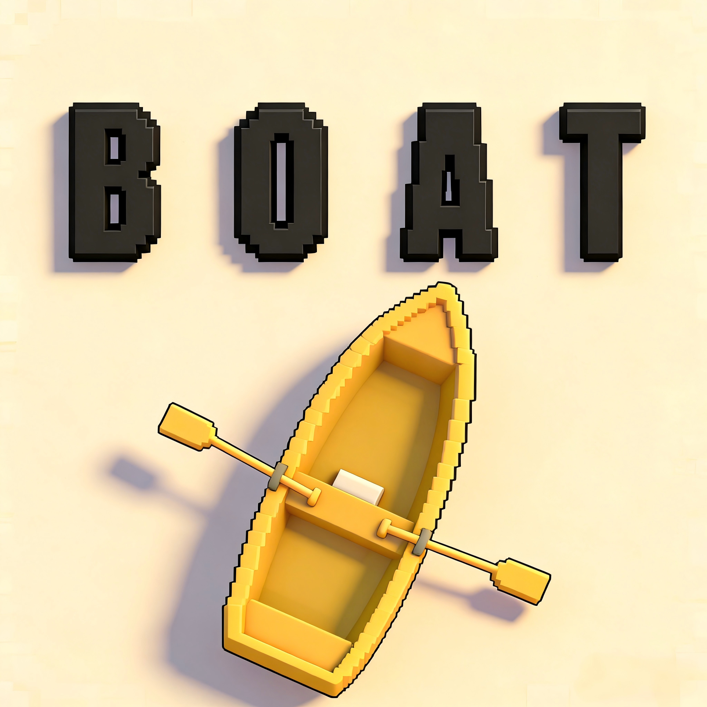

# Boat

<div align="center">



**一款Unity 3D开发的第三人称水上船体冒险游戏**

[游戏特色](#-游戏特色) • [操作说明](#-操作说明) • [游戏玩法](#-游戏玩法) • [系统要求](#-系统要求) • [设计文档](./设计文档.md)

</div>

---

## 📖 游戏简介

**Boat** 是一款创新的水上船体冒险游戏。玩家将操控小船在水面上航行，体验真实的物理模拟、华丽的水波效果和刺激的物体破碎系统。通过收集钻石、击碎障碍物、完成关卡挑战，争取获得最高的三星评价！

### 🎯 游戏目标

- 🏁 **到达终点**：从起点航行到终点完成关卡
- 💎 **收集钻石**：每关收集5个钻石，获得3星评价
- 💥 **击碎障碍**：使用投掷物击碎障碍物，获得额外得分
- ⭐ **争取高分**：挑战自己，争取获得3星评价
- ⭐ 

---

## 🎮 游戏玩法

### 核心玩法

#### 🚤 船体操控
- 使用 **WASD键** 控制小船移动和转向
- 体验真实的浮力物理效果
- 船体移动时会产生动态水波
- 躲避障碍物和陆地，触碰到即会死亡

#### 🎯 导弹发射
- **鼠标右键** 发射导弹
- 导弹方向跟随鼠标，实现精确瞄准
- 击碎障碍物获得得分

#### 💎 钻石收集
- 每关有 **5个钻石** 等待收集
- 收集钻石获得 **+10分**
- 收集所有钻石可获得 **3星评价**

#### ⭐ 星级评价
- **1星**：抵达终点
- **2星**：总分达到130分以上
- **3星**：收集完所有5个钻石

#### 🏪 商店系统
- **11种船体** 可供选择
- **9种导弹** 类型
- **3D预览** 功能，支持鼠标旋转查看
- 购买和装备喜欢的船体和导弹

#### 🕹️ 设置界面
- **音频设置**  调节背景音乐音量、音效音量
- **游戏参数** 调整移动速度和转向速度，自由选择游戏难度
- **数据管理** 清空游戏数据或积分，重置后重新进入游戏即可生效
- 购买和装备喜欢的船体和导弹
---

## 🎨 游戏特色

### ✨ 真实物理模拟
- **浮力系统**：船体根据在水中的深度产生真实的浮力效果
- **稳定性控制**：防止船体过度倾斜，保持舒适的游戏体验
- **动态水波**：船体移动和鼠标点击都会产生真实的水波效果

### 💥 华丽视觉效果
- **物体破碎**：使用先进的Voronoi算法实现真实的破碎效果
- **粒子特效**：钻石收集时的华丽粒子特效和环形光波
- **得分动画**：收集物品时的动态得分显示，带有弹跳和淡出效果

### 🎮 流畅操作体验
- **第三人称视角**：摄像头平滑跟随船体
- **实时破碎**：导弹射击障碍物的不同位置可以进行实时破碎
- **精确瞄准**：导弹发射方向跟随鼠标位置

### 📦 丰富游戏内容
- **4个游戏关卡**：每个关卡都有独特的挑战
- **多种船体和导弹**：20种不同的装备组合
- **动态障碍物**：可破坏的障碍物和不可破坏的陆地

---

## 🕹️ 操作说明

### 基本操作

| 操作 | 按键 | 说明 |
|------|------|------|
| 前进 | **W** | 船体向前移动 |
| 后退 | **S** | 船体向后移动 |
| 左转 | **A** | 船体向左转向 |
| 右转 | **D** | 船体向右转向 |
| 发射导弹 | **鼠标右键** | 瞄准目标后发射 |
| 实时水波 | **鼠标左键** | 点击水面产生水波 |
| 暂停游戏 | **ESC** | 暂停/恢复游戏/退出游戏 |

### 游戏技巧

💡 **获得3星的技巧**：
1. 仔细观察钻石位置，规划最优路线
2. 收集所有5个钻石是获得3星的必要条件
3. 击碎障碍物可以获得额外得分
4. 注意避开障碍物和陆地，确保安全到达终点

💡 **高分技巧**：
- 基础通关：100分
- 收集钻石：5个 × 10分 = 50分
- 击碎障碍：每个 +2分
- **最高得分** = 100 + 50 + (障碍物数量 × 2)

---

## 🎯 得分系统

### 得分规则

- **基础通关分数**：100分（到达终点即可获得）
- **收集钻石**：+10分/个（每关5个，共50分）
- **击碎障碍物**：+2分/个

### 星级评价

| 星级 | 条件 | 说明 |
|------|------|------|
| ⭐ | 抵达终点 | 基础通关 |
| ⭐⭐ | 总分 ≥ 130分 | 需要收集钻石或击碎障碍物 |
| ⭐⭐⭐ | 收集完所有5个钻石 | 完美通关 |

---

## 🏪 商店系统

### 船体选择
- 11种不同的船体
- 每种船体都有独特的外观
- 在商店中可以3D预览船体模型

### 导弹选择
- 9种不同的导弹类型
- 不同的视觉效果
- 支持3D预览功能

### 装备系统
- 购买未拥有的船体和导弹
- 装备已拥有的物品
- 装备信息自动保存，在关卡中使用

---

## ⚙️ 设置系统

### 音频设置
- 调节背景音乐音量
- 调节音效音量
- 设置自动保存

### 游戏参数
- **移动速度**：10-50（默认25）
- **转向速度**：1-10（默认3.5）
- 设置会立即应用到当前场景

### 数据管理
- 清空所有游戏数据
- 只清空积分
- 重置游戏进度
- 重置后重新进入游戏即可生效

---

## 🎬 游戏场景

游戏包含以下场景：

- **主菜单** (UI.unity) - 游戏入口
- **关卡选择** (Select.unity) - 选择要游玩的关卡
- **商店** (Shop.unity) - 购买和装备船体、导弹
- **游戏关卡1** (scene1.unity)
- **游戏关卡1-2** (scene1two.unity)
- **游戏关卡2** (scene2.unity)
- **游戏关卡2-2** (scene2two.unity)

---

## 💻 系统要求

### 最低配置
- **操作系统**：Windows 10 或更高版本
- **处理器**：Intel Core i5 或同等配置
- **内存**：8 GB RAM
- **显卡**：NVIDIA GeForce GTX 960 或同等配置
- **存储空间**：至少 2 GB 可用空间
- **Unity版本**：Unity 2023.1.0f1 或更高版本

### 推荐配置
- **操作系统**：Windows 11
- **处理器**：Intel Core i7 或更高
- **内存**：16 GB RAM
- **显卡**：NVIDIA GeForce GTX 1060 或更高
- **存储空间**：5 GB 可用空间

---

## 🚀 快速开始

### 运行游戏

1. **打开Unity编辑器**
   - 使用Unity 2023.1.0f1 或更高版本打开项目

2. **选择启动场景**
   - 打开 `Assets/Scenes/UI.unity` 场景

3. **运行游戏**
   - 点击Unity编辑器的播放按钮
   - 或按 `Ctrl + P` 快捷键

4. **开始游戏**
   - 在主菜单点击"开始游戏"
   - 选择关卡开始冒险

### 游戏流程

```
主菜单 → 关卡选择 → 商店（可选）→ 游戏关卡 → 结算界面
```

## 🎉 游戏特色亮点

### 🌊 真实水波系统
- 船体移动时自动产生水波
- 鼠标点击水面也会产生水波
- 使用GPU加速的实时渲染

### 💥 物体破碎系统
- 使用Voronoi算法实现真实破碎
- 碎片具有真实的物理属性
- 击碎障碍物获得得分

### ⭐ 三星评价系统
- 每关最高可获得3星
- 需要收集所有钻石才能获得3星
- 挑战完美通关

### 🎨 华丽特效
- 钻石收集时的粒子特效
- 环形光波扩散效果
- 浮动得分动画

<div align="center">

**感谢游玩 Boat！祝您游戏愉快！** 🎮

</div>

